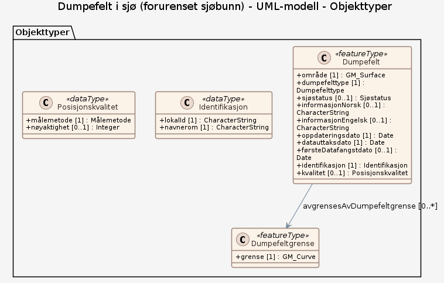

# Produktspesifikasjon: Dumpefelt i sjø (forurenset sjøbunn)

*Datasettet angir geografisk område for dumpefelt avmerket i sjøkart langs norskekysten. 
Datasettet inneholder informasjon om status og type dumpefelt.
Formålet med tjenesten er å bidra til kyst- og fiskeriforvaltning, arealplanlegging, samferdsel og samfunnssikkerhet. 
Dumpefelt i sjø er fast avsatte sjøområder hvor det tidligere ble dumpet masse og avfall som anses som skadelig og som det må tas hensyn til ved bruk og ferdsel i området. 
Dumpefeltene publiseres i dag i navigasjonsproduktene sjøkart og elektroniske sjøkart. De publiseres også i karttjenesten Den norske los.
Alle dumpefelt i norske sjøkart er merket med status 'disused', altså 'ikke i bruk' på grunn av forurensingsforskriften. 
All dumping i sjø er forbudt, jamfør Forskrift om begrensning av forurensning (forurensningsforskriften). 
Datasettet forvaltes kontinuerlig og publiseres av Kartverket.*

**Nøkkelord:** Dumpefelt i sjø, Forurenset sjøbunn, Dumpefelt med forurenset sjøbunn, Uren bunn, Kystsoneforvaltning, Planarbeid, Norge digitalt, Nautisk informasjon, fellesDatakatalog, Kyst og fiskeri, Samferdsel, Samfunnssikkerhet, Plan, Forurensning, Dumpefeltgrense, Dumpefelt, dumpefelttype, sjøstatus, informasjonNorsk, informasjonEngelsk

**Emnekategorier:** 

**Geografisk utstrekning**:

- **Vest**: 4.0
- **Øst**: 31.0
- **Sør**: 57.0
- **Nord**: 71.0

**Tidsmessig utstrekning**:

- **Tidsperiode**:
  - **Fra**: 2026-01-19
  - **Til**: 2026-05-06

## Om spesifikasjonen

> **Denne versjonen av produktspesifikasjonen:**  
> **Opprettet dato:** 2026-01-19 
> **Endret dato:** 2026-05-06 
> **Språk:** nor 
> **Kontaktinformasjon:** Kartverket, [reisir@kartverket.no](mailto:reisir@kartverket.no)

## Om produktet Dumpefelt i sjø (forurenset sjøbunn)

> **Romlig representasjonstype:** Vektor 
> **Unik identifikator:** <https://data.geonorge.no/sosi/kyst/dumpefelt_i_sjo> 
> **Kontaktinformasjon:** Kartverket, [reisir@kartverket.no](mailto:reisir@kartverket.no)
>
> **Romlig oppløsning:**
>
> **Ekvivalent målestokk**: 50000
>
> **Begrensninger:**
>
> **Ressursbegrensninger**:
>
> - **Bruksbegrensninger**: Ingen bruksbegrensing
>
> **Juridiske begrensninger**:
>
> - **Tilgangsbegrensninger**: Åpne data
> - **Bruksbegrensninger**: Lisens
> - **Lisens**: Creative Commons BY 4.0 (CC BY 4.0)
> - **Lisenslenke**: <https://creativecommons.org/licenses/by/4.0/>
>
> **Sikkerhetsbegrensninger**:
>
> - **Klassifisering**: Ugradert

### Formål

Dumpefelt i sjø er opprettet og holdes kontinuerlig oppdatert for å understøtte produksjonen av navigasjonsprodukt.

### Bruksområde

Dumpefelt i sjø er informasjon som kan være nyttig i et beslutningsverktøy i forbindelse med plan – og forvaltningsarbeid. 
Datasettet kan benyttes til planlegging, illustrasjoner, forskning og analyse i forbindelse med f.eks: - kystsoneplanlegging - utbygging i kystsonen - underlag for ulike type temakart - forprosjektering av forskjellige undervannsaktiviteter - planlegging av fiskeri og havbruk - underlag for verneområder - underlag for beredskapsplaner - forprosjektering av trase for sjøkabel/rørledning.
Tjenesten inneholder informasjon om dumpefelt i sjø som ikke foreligger andre steder.

## Omfang

### Hele datasettet

**Nivå**: dataset

**Nivåbeskrivelse**: Gjelder hele datasettet. Hvis omfang ikke er oppgitt under en overskrift, gjelder teksten for hele datasettet og alle leveranser

### UML-modell

**Nivå**: dataset

## Datainnhold og struktur

### Datamodell - UML-modell

➡️ [Se full datamodell for omfang "UML-modell" (diagram per pakke og objektkatalog)](uml-modell/objektkatalog.html)

## Referansesystem

| EPSG-kode | Navn på referansesystem |
| --- | --- |
| [EPSG:25832](https://epsg.io/25832) | [EUREF89 UTM sone 32, 2d](https://register.geonorge.no/epsg-koder) |
| [EPSG:25833](https://epsg.io/25833) | [EUREF89 UTM sone 33, 2d](https://register.geonorge.no/epsg-koder) |
| [EPSG:25835](https://epsg.io/25835) | [EUREF89 UTM sone 35, 2d](https://register.geonorge.no/epsg-koder) |
| [EPSG:3035](https://epsg.io/3035) | [EUREF89 / ETRS89-LAEA Europe](https://register.geonorge.no/epsg-koder) |
| [EPSG:4258](https://epsg.io/4258) | [EUREF 89 Geografisk (ETRS 89) 2d](https://register.geonorge.no/epsg-koder) |

## Datakvalitet

**Nivå**: dataset

**Kvalitetsmål**: SOSI produktspesifikasjon: Dumpefelt i sjø (forurenset sjøbunn)

- **Beskrivende resultat**: Dataene er i henhold til produktspesifikasjonen

**Kvalitetsmål**: Sosi applikasjonsskjema

- **Beskrivende resultat**: GML-filer er i henhold til applikasjonsskjema

## Datafangst og produksjon

**Datainnsamling og prosessering**:

- **Prosesstrinn**:
  - **Beskrivelse**:
    Dumpefelt er basert på informasjon fra havner og kommuner om dumping av vrak, kabler, mudret masse etc. 
    Datasettet holdes i dag løpende oppdatert basert på innsendt informasjon om endring av eksisterende dumpefelt og/eller nye dumpefelt fra Forsvaret, Kystverket, fylker og kommuner. 
    Oversikten over dumpefelt i sjø er ikke utfyllende siden informasjonen om hvor det er dumpet ammunisjon, annet krigsmateriell, skrot og fartøy langs norskekysten er svært mangelfull. Det er vitnebeskrivelser som indikere at det ble dumpet tysk krigsmateriell i mange flere norske fjorder. Det finnes også omtale av dumpefelt i sjø ifm søknader om å dumpe mudret masse, som heller ikke er avmerket i sjøkart.

## Vedlikehold

**Vedlikeholdsfrekvens**: Daglig

**Status**: Kontinuerlig oppdatert

## Presentasjon

**navn**: Tegneregler

**Lenke**:
<https://register.geonorge.no/tegneregler/dumpefelt-i-sjø-forurenset-sjøbunn>

## Leveranse

| Tjeneste | Endepunkt | Type | Format | Leveranseenheter |
| --- | --- | --- | --- | --- |
| Geonorge nedlastning | [Lenke](https://nedlasting.geonorge.no/api/capabilities/) | GEONORGE:DOWNLOAD | FGDB, GML, GPKG | fylkesvis, kommunevis, landsfiler |
| Atom Feed | [Lenke](http://nedlasting.geonorge.no/geonorge/ATOM-feeds/DumpefeltSjo_AtomFeedFGDB.xml) | W3C:AtomFeed | FGDB | fylkesvis, kommunevis, landsfiler |
| Atom Feed | [Lenke](http://nedlasting.geonorge.no/geonorge/ATOM-feeds/DumpefeltSjo_AtomFeedGML.xml) | W3C:AtomFeed | GML | fylkesvis, kommunevis, landsfiler |
| Atom Feed | [Lenke](http://nedlasting.geonorge.no/geonorge/ATOM-feeds/DumpefeltSjo_AtomFeedGPKG.xml) | W3C:AtomFeed | GPKG | fylkesvis, kommunevis, landsfiler |
| Dumpefelt i sjø (forurenset sjøbunn) WMS | [Lenke](https://wms.geonorge.no/skwms1/wms.dumpefelt_sjo?request=GetCapabilities&service=WMS) | WMS-tjeneste | WMS |  |

## Metadata

**Metadatastandard**: ISO19115

**Metadatastandardversjon**: 2003

**Metadatadato**: 2026-09-16

**språk**: nor

**Kontakt**:

- **Organisasjon**: Kartverket
- **Kontaktperson**: Kundesenter
- **Logo**: <https://register.geonorge.no/data/organizations/971040238_Kartverket_liten.png>
- **Epost**: kundesenter@kartverket.no
- **rolle**: pointOfContact

**Metadataidentifikator**:

- **Utsteder**: Geonorge
- **kode**: d1b5217b-871d-4591-9597-a76f5a5668fc
- **koderom**: <https://kartkatalog.geonorge.no/metadata/>
- **Metadatalenke**: <https://kartkatalog.geonorge.no/metadata/d1b5217b-871d-4591-9597-a76f5a5668fc>

## Tilleggsinformasjon

Trenger du hjelp til å laste ned og ta i bruk Kartverkets data og tjenester? På kartverket.no finner du tips og veiledninger.

- **Produktark:** [https://register.geonorge.no/produktark/dumpefelt-i-sjø-forurenset-sjøbunn](https://register.geonorge.no/produktark/dumpefelt-i-sjø-forurenset-sjøbunn)
