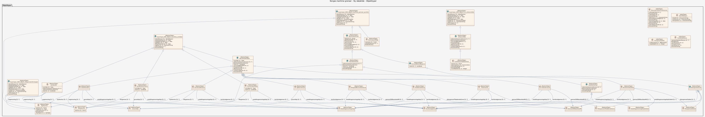

# Produktspesifikasjon: Norges maritime grenser

*Norges maritime grenser er en samlebetegnelse for grenser og soner i havområder som inngår i Norges lover og forskrifter. Grensene og områdene er sammenstilt i et offisielt vektordatasett som dekker områdene Fastlands-Norge, Jan Mayen og Svalbard, samt Bouvetøya.*

**Nøkkelord:** Sjøgrense, Sjøgrenser, fiskerisone, fiskevernsone, delelinje, økonomisk sone, grunnlinje, territorialgrense, tilstøtende sone, indre farvann, territorialfarvann, sjøterritorium, barentswatch, maritime grenser, kontinentalsokkel, Bouvetøya, Svalbard, Jan Mayen, Norge, Havområder, Barentshavet, Norskehavet, Administrative enheter, Inspire, Det offentlige kartgrunnlaget, geodataloven, Norge digitalt, fellesDatakatalog, Basis geodata, NorskeGrenser, dokumentasjonsreferanse, land, BeregnetGrense, BeregnetMidtlinje, Territorialområde, InternasjonaltFarvann, Gråsonen, AvtaltAvgrensningslinje, MerketGrensepunkt, beskrivelse, etableringsdato, Grensebøye, TidligereOmstridtOmråde, Gråsonegrense, TilstøtendeSone, YttergrenseTilstøtendeSone, IndreFarvann, NorgesØkonomiskeSone, Sektorlinje, MaritimeOmråder, virkeområdenavn, sonetype, miljøområde, spesialisertSonetype, DetSærskilteOmrådet, Kystkontur, grense, kystreferanse, kysttype, Sjørøys, LandIndreFarvann, YttergrenseSokkel, MaritimtPunkt, punktreferanse, AvtalteGrenser, GrenseMellomNasjoner, MaritimeGrenser, grensestatus, fastsettingstype, 200NautiskeMil

**Emnekategorier:** Administrative grenser

**Tidsmessig utstrekning**:

- **Tidsperiode**:
  - **Fra**: 2007-07-01
  - **Til**: 2025-04-11

## Om spesifikasjonen

> **Denne versjonen av produktspesifikasjonen:**  
> **Opprettet dato:** 2007-07-01 
> **Endret dato:** 2025-04-11 
> **Språk:** nor 
> **Kontaktinformasjon:** Kartverket, [kundesenter@kartverket.no](mailto:kundesenter@kartverket.no)

## Om produktet Norges maritime grenser

> **Romlig representasjonstype:** Vektor 
> **Unik identifikator:** <https://data.geonorge.no/sosi/administrativeenheter/norges_maritime_grenser> 
> **Kontaktinformasjon:** Kartverket, [kundesenter@kartverket.no](mailto:kundesenter@kartverket.no)
>
> **Romlig oppløsning:**
>
> **Ekvivalent målestokk**: 50000
>
> **Begrensninger:**
>
> **Ressursbegrensninger**:
>
> - **Bruksbegrensninger**: Ingen begrensninger på bruk er oppgitt.
>
> **Juridiske begrensninger**:
>
> - **Tilgangsbegrensninger**: Åpne data
> - **Bruksbegrensninger**: Lisens
> - **Lisens**: Creative Commons BY 3.0 (CC BY 3.0)
> - **Lisenslenke**: <http://creativecommons.org/licenses/by/3.0/no/>
>
> **Sikkerhetsbegrensninger**:
>
> - **Klassifisering**: Ugradert

### Formål

Kunne tilby et sømløst datasett med Norges offisielle maritime grenser med tilfredsstillende nøyaktighet for nasjonens suverenitetshevdelse, ressursutnyttelse, oppsyn og navigasjon. Effektiv og god forvaltning av de maritime grensene. Effektivt kunne tilgjengeliggjøre oppdaterte maritime grenser.

### Bruksområde

Til bruk for nasjonens suverenitetshevdelse, ressursutnyttelse, oppsyn og navigasjon. Egner seg blant annet til bakgrunnsinformasjon for planlegging og presentasjon av statistikk og analyser, oversiktskart, interaktive kart og datagrunnlag for kartløsninger på Internett.

## Omfang

### Hele datasettet

**Nivå**: dataset

**Nivåbeskrivelse**: Gjelder hele datasettet. Hvis omfang ikke er oppgitt under en overskrift, gjelder teksten for hele datasettet og alle leveranser

### Ny datakilde

**Nivå**: dataset

## Datainnhold og struktur

### Datamodell - Ny datakilde

➡️ [Se full datamodell for omfang "Ny datakilde" (diagram per pakke og objektkatalog)](ny-datakilde/objektkatalog.html)

## Referansesystem

| EPSG-kode | Navn på referansesystem |
| --- | --- |
| [EPSG:25833](https://epsg.io/25833) | [EUREF89 UTM sone 33, 2d](https://register.geonorge.no/epsg-koder) |
| [EPSG:3035](https://epsg.io/3035) | [EUREF89 / ETRS89-LAEA Europe](https://register.geonorge.no/epsg-koder) |
| [EPSG:4258](https://epsg.io/4258) | [EUREF 89 Geografisk (ETRS 89) 2d](https://register.geonorge.no/epsg-koder) |

## Datakvalitet

**Nivå**: dataset

- **Kvalitetsmål**: COMMISSION REGULATION (EU) No 1089/2010 of 23 November 2010 implementing Directive 2007/2/EC of the European Parliament and of the Council as regards interoperability of spatial data sets and services
  **Målebeskrivelse**: The dataset is established according to national specifications.
  **Beskrivende resultat**: The dataset is established according to national specifications.

- **Kvalitetsmål**: SOSI-produktspesifikasjon: Administrative enheter - Norges maritime grenser
  **Målebeskrivelse**: Dataene er i henhold til produktspesifikasjonen
  **Beskrivende resultat**: Dataene er i henhold til produktspesifikasjonen

- **Kvalitetsmål**: Sosi applikasjonsskjema
  **Målebeskrivelse**: SOSI-filer er i henhold til applikasjonsskjema
  **Beskrivende resultat**: SOSI-filer er i henhold til applikasjonsskjema

- **Kvalitetsmål**: Sosi applikasjonsskjema
  **Målebeskrivelse**: GML-filer er i henhold til applikasjonsskjema
  **Beskrivende resultat**: GML-filer er i henhold til applikasjonsskjema

- **Kvalitetsmål**: Prosentvis oppfyllelse av FAIR-prinsipper
  **Målebeskrivelse**: Angir fullstendighet i forhold til krav fra FAIR-prinsippene (The FAIR Guiding Principles for scientific data management and stewardship)
  **Resultat**: 95

- **Kvalitetsmål**: FAIR
  **Resultat**: Prosentvis oppfyllelse av FAIR-prinsipper: 95%

## Datafangst og produksjon

**Datainnsamling og prosessering**:

- **Prosesstrinn**:
  - **Beskrivelse**: Avledet fra..

## Vedlikehold

**Vedlikeholdsfrekvens**: Etter behov

## Presentasjon

**navn**: Tegneregler

**Lenke**:
<https://register.geonorge.no/register/versjoner/tegneregler/kartverket/norges-maritime-grenser>

## Leveranse

| Tjeneste | Endepunkt | Type | Format | Leveranseenheter |
| --- | --- | --- | --- | --- |
| Geonorge nedlastning | [Lenke](https://nedlasting.geonorge.no/api/capabilities/) | GEONORGE:DOWNLOAD | FGDB, GML, PostGIS, SOSI | landsfiler |
| Atom Feed | [Lenke](http://nedlasting.geonorge.no/geonorge/ATOM-feeds/NorgesMaritimeGrenser_AtomFeedFGDB.xml) | W3C:AtomFeed | FGDB | landsfiler |
| Atom Feed | [Lenke](http://nedlasting.geonorge.no/geonorge/ATOM-feeds/NorgesMaritimeGrenser_AtomFeedGML.xml) | W3C:AtomFeed | GML | landsfiler |
| Atom Feed | [Lenke](http://nedlasting.geonorge.no/geonorge/ATOM-feeds/NorgesMaritimeGrenser_AtomFeedPostGIS.xml) | W3C:AtomFeed | PostGIS | landsfiler |
| Atom Feed | [Lenke](http://nedlasting.geonorge.no/geonorge/ATOM-feeds/NorgesMaritimeGrenser_AtomFeedSOSI.xml) | W3C:AtomFeed | SOSI | landsfiler |
| Norges økonomiske sone | [Lenke](https://wms.geonorge.no/skwms1/wms.nmg?) | Tjenestelag | OGC WMS |  |
| Internasjonalt farvann | [Lenke](https://wms.geonorge.no/skwms1/wms.nmg?service=wms&request=getcapabilities) | Tjenestelag | OGC WMS |  |
| Landareal Norge | [Lenke](http://wms.geonorge.no/skwms1/wms.nmg?service=wms&request=getcapabilities) | Tjenestelag | OGC WMS |  |
| Avtalt avgrensningslinje for kontinentalsokkel | [Lenke](http://wms.geonorge.no/skwms1/wms.nmg?) | Tjenestelag | OGC WMS |  |

## Metadata

**Metadatastandard**: ISO19115

**Metadatastandardversjon**: 2003

**Metadatadato**: 2026-08-14

**språk**: nor

**Kontakt**:

- **Organisasjon**: Kartverket
- **Kontaktperson**: Liv Mari Nesje
- **Logo**: <https://register.geonorge.no/data/organizations/971040238_Kartverket_liten.png>
- **Epost**: kundesenter@kartverket.no
- **rolle**: pointOfContact

**Metadataidentifikator**:

- **Utsteder**: Geonorge
- **kode**: e106adf4-c9d8-4fce-a9b5-7886a4126d23
- **koderom**: <https://kartkatalog.geonorge.no/metadata/>
- **Metadatalenke**: <https://kartkatalog.geonorge.no/metadata/e106adf4-c9d8-4fce-a9b5-7886a4126d23>

