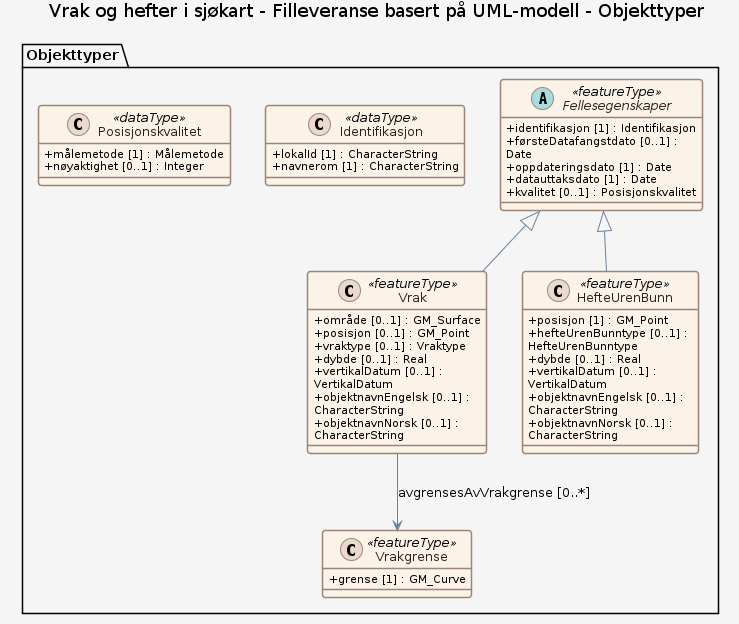
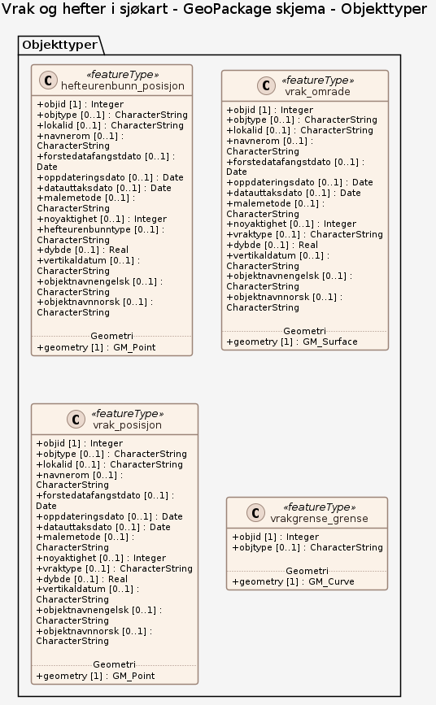

### Datamodell - Filleveranse basert på UML-modell

➡️ [Se full datamodell for omfang "Filleveranse basert på UML-modell" (diagram per pakke og objektkatalog)](filleveranse-basert-pa-uml-modell/objektkatalog.html)

### Datamodell - GeoPackage skjema

➡️ [Se full datamodell for omfang "GeoPackage skjema" (diagram per pakke og objektkatalog)](geopackage-skjema/objektkatalog.html)
